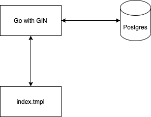

# GO Lang Contacts demo application
Demo Web Application for Adding user contact information

A simple web application with Go using

1. GIN Framework
2. Postgress
3. HTML/JavaScript




## API List
### GET : Get all contancts
```
GET /contacts HTTP/1.1
Host: localhost:8080
```
### POST : Create a contact
```
POST /contacts HTTP/1.1
Host: localhost:8080
Content-Type: application/json

{ "first_name":"first_name","last_name":"last_name","email":"email@email.com","phone_numbers":["04********", "+614********"]}
```
## Project setup
* Install latest version  [Go Lang](https://golang.org/dl/)
* Install latest version of [Postgres](https://www.postgresql.org/download/) database 
* Optional install [Visual Studio Code](https://code.visualstudio.com/docs/languages/go) for GO Lang

## Quick Start

1. Clone GO-Contantacs repo to your local and add environment varialbes required , rename `.env_sample` to `.env`  
2. After updating the `.env` file run the following commands from root folder
3. Create users & contacts tables to your db schema by using [data.sql](data.sql)

```
go mod tidy
go run .
```
> All set to add and retrive user contact information using go web server

## Useful resources
- [GO Lang](https://golang.org/doc/tutorial/getting-started)
- [GO Lang with GIN for REST API](https://golang.org/doc/tutorial/web-service-gin)
- [Postgres](https://pkg.go.dev/github.com/lib/pq)
- [Fetch API](https://developer.mozilla.org/en-US/docs/Web/API/Fetch_API)

